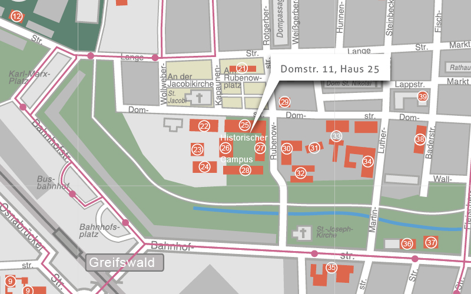

# Veranstaltungsorte
Ernst-Moritz-Arndt-Universität Greifswald

*Konferenzsaal* im Hauptgebäude der Universität Greifswald
Domstraße 11 / Eingang 2

17489 Greifswald

<iframe width="100%" height="500px" frameBorder="0" src="Conf_GettingHere_Web.pdf"></iframe>

#### Tagung (Donnerstag, 23. Juni 2016 bis Freitag, 24. Juni 2016)  
Ernst-Moritz-Arndt-Universität Greifswald
*Konferenzsaal* im Hauptgebäude der Universität Greifswald
Domstraße 11 / Eingang 2

#### Exkursion
beide Exkursionen starten am Bahnhof Greifswald.

### Anreise
Greifswald ist mit dem Zug komfortabel zu erreichen. Der Greifswalder Hauptbahnhof liegt in unmittelbarer Nähe zum Universitätsgebäude in der Innenstadt. Er wird von der Strecke Stralsund-Berlin bedient und ist  sowohl mit dem Inter-City, als auch mit dem Regionalexpress über eine Direktverbindung von Berlin erreichbar.

Der Zustieg in alle Züge von Berlin nach Greifswald ist an den Bahnhöfen Berlin-Hauptbahnhof und Berlin-Gesundbrunnen möglich.

Stündlich gibt es eine Verbindung nach Greifswald. Die Fahrt von Berlin nach Greifswald dauert rund 2,5 Stunden.
Fahrpreis (einfach/ohne Ermäßigungen): rund 30 € (RE), 39 € (IC/EC). Besonders günstig ist das Ostsee-Ticket, dass für Hin- und Rückfahrt gilt.

Die Fahrt von Hamburg nach Greifswald dauert rund drei bis fünf Stunden. Es gibt regelmäßige Verbindungen mit Zu-/Umsteigemöglichkeiten in Stralsund, Lübeck oder Rostock.
Fahrpreis (einfach/ohne Ermäßigungen): zwischen 42 und 54 €

<a href="../files/Conf_GettingHere_Web.pdf" class="download">↓ Informationen zur Anreise (Engl.)</a> 
<a href = "../files/Conf_GettingAround_Web.pdf" class="download">↓ Informationen zur Orientierung in Greifswald (Engl.)</a>

