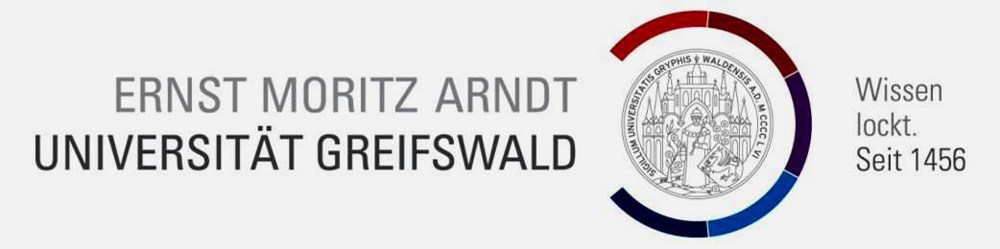
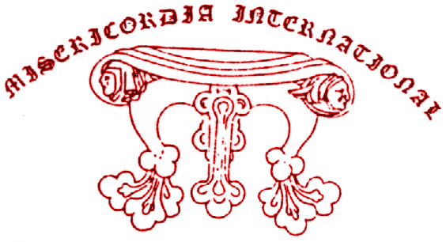
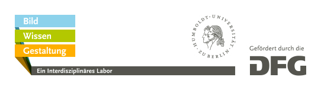

# Legal Notice

A Conference organized by the Ernst-Moritz-Arndt-University, Caspar-David-Friedrich-Institut and Misericordia International in collaboration with Cluster of Excellence »_Image Knowledge Gestaltung_. An Interdisciplinary Laboratory« and funded by German Research Foundation (DFG)

## Partners

[{: width="248px" margin-right="10px"}](http://www.cdfi.de/)

[{: width="248px"}](http://misericordia-international.blogspot.co.uk/)

[{: width="500px"}](https://www.interdisciplinary-laboratory.hu-berlin.de)

## Concept and Organization

Anja Seliger M.A., Research Associate, »_Image Knowledge Gestaltung_. An Interdisciplinary Laboratory«  
Prof. Dr. Gerhard Weilandt, Ernst-Moritz-Arndt-University, Caspar-David-Friedrich-Institut  

## Layout & Design

Johannes Herseni, Interface Designer, »_Image Knowledge Gestaltung_. An Interdisciplinary Laboratory«   
[http://johannesherseni.com](http://johannesherseni.com/)
Babette Wiezorek, Product Designer,  »_Image Knowledge Gestaltung_. An Interdisciplinary Laboratory« (https://www.interdisciplinary-laboratory.hu-berlin.de/de/personen/babette-wiezorek)

## Contact

Cluster of Excellence »_Image Knowledge Gestaltung_. An Interdisciplinary Laboratory«  
Humboldt-Universität zu Berlin  
Unter den Linden 6  
10099 Berlin  

E-Mail: [bwg.zeichen-und-symbole@hu-berlin.de](mailto:bwg.zeichen-und-symbole@hu-berlin.de)  
Web: [www.interdisciplinary-laboratory.hu-berlin.de](http://www.interdisciplinary-laboratory.hu-berlin.de)

Picture credits: SMB, Kunstbibliothek, Sammlung-Modebild
